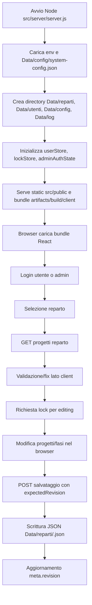
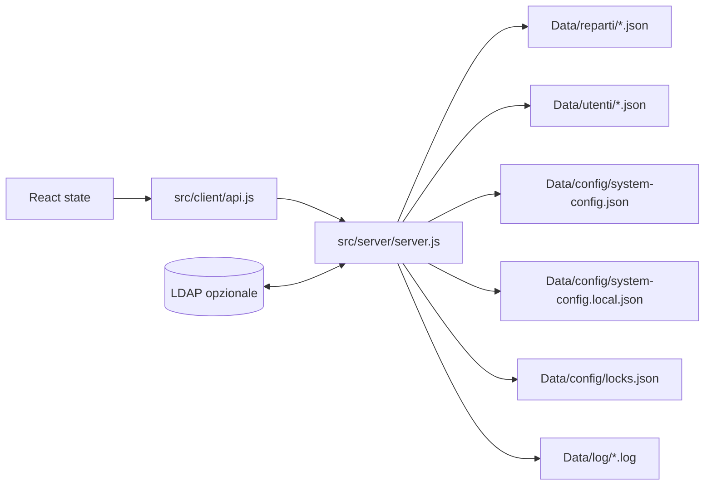

# APP_FLOW.md

Audit tecnico del flusso reale di OnlyGANTT, ricostruito dal codice al 2026-05-14.

## Schema generale



## Componenti principali

- Frontend: React 19 bundle IIFE generato da esbuild, entrypoint `src/client/bundle-entry.jsx`, root `src/client/app.jsx`.
- Backend: Express in `src/server/server.js`.
- Persistenza: file JSON in `Data/reparti`, `Data/utenti`, `Data/config`; log in `Data/log`.
- Lock: `src/server/lockStore.js`, stato in memoria con snapshot `Data/config/locks.json`.
- Auth utente: sessioni in memoria, token via header `X-User-Token` o body `userToken`.
- Auth admin: token admin in memoria via `Authorization: Bearer`.
- LDAP opzionale: `src/server/ldapService.js`.
- Servizio Windows: wrapper .NET in `src/service/OnlyGantt.Service/Program.cs` che avvia Node.
- Packaging: WiX in `tools/wix`, script in `scripts/support/packaging`.

## Flusso utente principale

1. Il browser apre `/` e scarica `/assets/app.bundle.js`.
2. `storage.getActiveSession()` prova a ripristinare `userName`, `department`, `userToken`, `adminToken` da sessionStorage.
3. `LoginScreen` carica `/api/departments` e `/api/auth/config`.
4. Utente standard:
   - con LDAP attivo: invia `userId/password` a `/api/auth/login`;
   - con utenti locali presenti: invia `userId/password`;
   - senza LDAP e senza utenti locali: puo' ricevere sessione `standard` con solo username.
5. Se il reparto risulta protetto, la UI chiama `/api/departments/:name/verify`.
6. L'app carica `/api/projects/:department`.
7. Per modificare, l'utente abilita/acquisisce lock con `/api/lock/:department/acquire`.
8. La UI modifica stato locale React.
9. Il salvataggio invia `projects`, `expectedRevision`, `userName` a `/api/projects/:department`.
10. Il server verifica token utente, ownership lock e revision, poi scrive il JSON reparto.

## Flusso admin

```mermaid
flowchart TD
    A[Login admin] --> B[/api/admin/login]
    B --> C[adminToken + userToken admin]
    C --> D[Gestione reparti]
    C --> E[Gestione utenti locali/LDAP]
    C --> F[System settings]
    F --> G[Scrive Data/config/system-config.json]
    F --> H[Scrive sidecar system-config.local.json per bindPassword]
    C --> I[Import/export modulare]
    C --> J[Restart server]
```

L'admin puo' creare/cancellare reparti, resettare password reparto, liberare lock, gestire utenti locali, testare LDAP, importare/esportare moduli e riavviare il server.

## Flusso dati



I progetti vivono nel browser fino al salvataggio. Il backend usa revision incrementale per rilevare conflitti, ma non offre merge. La persistenza e' sincrona e file-based.

## Flusso auth/autorizzazione

```mermaid
flowchart TD
    A[/api/auth/login] --> B{LDAP enabled?}
    B -- si --> C[LDAP bind service + search + bind user]
    C -- ok --> D[upsert utente AD + token utente]
    C -- fail + fallback --> E[verifica utente locale]
    B -- no --> F{utenti locali = 0 e password vuota?}
    F -- si --> G[token standard username-only]
    F -- no --> E
    E -- ok --> H[token utente locale]
    H --> I[Token in memoria server]
    G --> I
    D --> I
```

Autorizzazione effettiva sulle mutazioni:
- salvataggio/import/upload richiedono sessione utente valida;
- richiedono lock posseduto dallo stesso `userName`;
- non verificano password reparto;
- lettura/export progetti non richiedono sessione.

Admin:
- `/api/admin/login` verifica admin configurato e password;
- il token admin e' in memoria;
- il client lo salva in sessionStorage;
- alcune operazioni admin rilasciano anche un token utente admin.

## Flusso persistenza

1. `ensureDataDir()` crea directory runtime.
2. Reparti: `Data/reparti/<name>.json`.
3. Utenti: `Data/utenti/<user>.json`.
4. Settings: `Data/config/system-config.json`; bind password LDAP nel sidecar ignorato `system-config.local.json`.
5. Lock: `Data/config/locks.json`, ricaricato all'avvio.
6. Scrittura: crea `.tmp`, opzionalmente `.bak`, elimina target, rinomina tmp.

Punto fragile: non ci sono transazioni, lock filesystem o recovery robusto in caso di crash a meta' scrittura.

## Flusso errori/fallback

- Backend: molti endpoint rispondono `{ error: { code, message } }`, ma spesso usano `err.message`.
- Client: `fetchJSON` assume JSON valido; HTML/413/proxy error possono causare parsing error non normalizzato.
- LDAP: timeout 10s, fallback locale opzionale se non `GROUP_REQUIRED`.
- Lock: heartbeat periodico; se fallisce il client passa a read-only/error, ma lo stato reale resta affidato al TTL.
- Conflitto revision: il client ricarica dati server e perde lo stato locale modificato.

## Integrazioni esterne/API

- LDAP via `ldapts`, configurabile da UI admin.
- HTTPS opzionale con key/cert locali.
- Packaging scarica Node MSI con hash e WiX zip senza hash pinning.
- Windows Service avvia Node con env `ONLYGANTT_DATA_DIR`, `PORT`, `ONLYGANTT_SERVICE_MANAGER`.

## Stati principali dell'app

- Nessun reparto selezionato: schermata login.
- Reparto selezionato read-only: lock disabilitato o lock di altro utente.
- Reparto selezionato locked: editing consentito.
- Dirty: modifiche locali non salvate.
- Draft progetto aperto: possibile differenza tra `projectDraft` e progetto salvato.
- Admin view: system settings o user management.
- Screensaver: overlay locale, eventualmente richiede password reparto.
- Sessione scaduta: evento `onlygantt:user-session-invalid` e reset stato.

## Assunzioni implicite nel codice

- Il client e' fidato abbastanza da fare gating password reparto.
- Un solo processo Node usa lo stesso dataDir.
- `userName` e' identificatore stabile e non ambiguo.
- La rete LDAP risponde entro timeout e non richiede paging.
- I backup importati sono piccoli abbastanza per il body parser.
- Gli admin non inseriscono valori numerici fuori range.
- Il canvas e' accettabile come esperienza primaria anche senza equivalente keyboard/screen reader completo.
- Il reset code admin puo' viaggiare come argomento servizio.

## Punti fragili del flusso

- Lettura dati non protetta server-side.
- Modalita' username-only troppo potente.
- Password reparto non e' parte del contratto backend per lettura/mutazione.
- Import admin non atomico.
- Persistenza file-based fragile sotto concorrenza/processi multipli.
- Error handling client fragile su risposte non JSON.
- Conflitti revision gestiti con perdita dello stato locale.
- Toolchain packaging parzialmente verificata.
